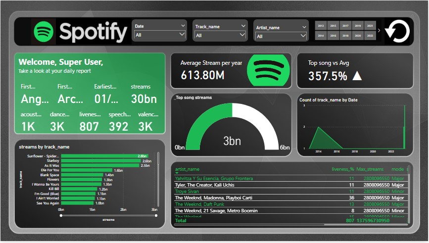

# Spotify Report Dashboard

Welcome to the Spotify Report Dashboard project! This advanced Power BI project offers valuable insights and statistics about Spotify data available on Kaggle. It features key visualizations and a user-friendly interface.

## Summary

The Spotify Dashboard project is designed to provide basic statistics and visualizations for Spotify data, with the convenience of an interactive and visually appealing Power BI dashboard.

## Project Workflow and Methodology

Here's an outline of the workflow and methodology used for this project:

1. **Data Extraction**: The project began by gathering Spotify data from Kaggle, ensuring data quality and consistency.

2. **Data Transformation**: The data was cleaned and preprocessed, including addressing missing values, handling outliers, and standardizing formats.

3. **Data Loading**: Transformed data was loaded into SQL databases, enabling efficient storage and retrieval for analysis.

4. **Dashboard Development**: An interactive Power BI dashboard was designed, incorporating key metrics, visualizations, and filters for in-depth exploration.

5. **Data Analysis**: Comprehensive analysis was conducted using SQL queries and Power BI functionalities to identify meaningful patterns, trends, and correlations.

6. **Insights and Recommendations**: Actionable insights were derived from the analysis, highlighting areas for improvement, growth opportunities, and potential strategies for optimization.

7. **Presentation and Collaboration**: Findings and recommendations were effectively communicated to stakeholders through visually appealing reports and presentations, fostering data-driven decision-making and collaboration across teams.

## Data Source

The project utilized readily available Spotify data from Kaggle. The data was cleaned, transformed, and prepared for analysis.

## Technologies and Tools Used

- Power BI 
- Excel
- PowerPoint
- Color palettes

## Functionality

The Spotify Report Dashboard offers the following functionalities:

- Basic statistics on song performance.
- An overview of how songs perform over time.
- Performance analysis of different artists.
- Average ratings of the top songs.

## Accessibility

You can explore the project in various formats available in this repository:

- Power BI (PBI) format
- ## JPEG images (Visualizations)

- ## PDF format

- ## Video format

## Conclusion

Thank you for taking the time to explore the Spotify Report Dashboard project. It provides valuable insights into Spotify data and serves as a powerful tool for data analysis and visualization.
